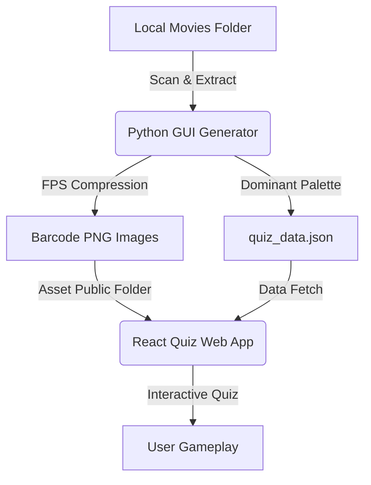

# CineCode

**Decoding cinema through color.**

Every film carries a hidden visual signature  a chromatic fingerprint shaped by the choices of cinematographers, colorists, and directors. CineCode compresses entire feature films into single-image color timelines, turning hours of footage into an artifact you can read at a glance.

Then it asks you: *can you recognize the film from its colors alone?*

>  **Play the quiz live →** [cinequiz.revanth.design](https://cinequiz.revanth.design)
>  **Generate your own cinecodes →** [cinecode.revanth.design](https://cinecode.revanth.design)

---

## Why Color?

Color grading is one of the most emotionally loaded decisions in filmmaking yet it's invisible to most audiences. A cold teal wash tells you something is clinical. Amber warmth signals nostalgia. A sudden shift to saturated red screams danger.

CineCode makes this language *legible*. By extracting every frame's dominant hue and laying them out chronologically, it reveals patterns that even cinephiles rarely notice:

- **The Matrix** reads as an almost monochromatic green-black gradient  its digital dystopia encoded in color.
- **La La Land** oscillates between deep indigo nights and golden-hour warmth, its romance visible as rhythm.
- **Moonlight** shifts across three distinct palettes  one for each chapter of its protagonist's life.

The barcode isn't decoration. It's a *data visualization of directorial intent*.

---

## The System



CineCode is two tools built around a shared data pipeline:

###  The Generator  *creation tool*

A Python desktop app for batch-extracting CineCode barcodes from local video files. Built with Tkinter, designed for speed and control.

| Feature | Detail |
|---|---|
| **Smart scanning** | Point at a movies folder. Excludes extras, featurettes, trailers automatically. |
| **Rendering modes** | Full-frame extraction or I-frame-only turbo mode for 10x speed. |
| **Smooth bars** | Averages adjacent colors for a cleaner, more painterly output. |
| **Live preview** | Watch the barcode render in real-time as FFmpeg processes each frame. |
| **Database manager** | Multi-select, filter, rename, and delete entries. Bulk title cleanup with inline editing and before/after preview. |

### The Quiz  *play experience*

A React + TypeScript web app that turns the barcode library into a guessing game. Two question types alternate randomly:

- **"Which film is this?"**  You see a barcode, pick from four movie titles.
- **"Which barcode is this?"**  You see a title, pick from four barcodes.

Wrong answers cost a heart. Streaks multiply your score. After each answer, the film's dominant color palette fans out as a reveal  a small reward loop that teaches you to *see* color differently over time.

The interface is built around a theater-dark aesthetic: glassmorphic panels, glow feedback on correct/incorrect answers, skeleton loaders for image states, and CSS gradient fallbacks when assets are missing.

---

## Design Thinking

This project emerged from an ethnographic curiosity: *how do people perceive color in motion pictures, and can that perception be trained through play?*

The generator exists for the researcher  someone who wants to produce and curate visual data from their own film library. The quiz exists for the player  someone who engages with that data through pattern recognition and cultural memory.

The two share a pipeline but serve fundamentally different modes of engagement: **analytical creation** and **intuitive recall**. The UX of each reflects that distinction. The generator is dense, configurable, and utilitarian. The quiz is focused, immediate, and affective.

Both are designed to make a single argument: **color is narrative**.

---

## Make Your Own Quiz

Got a hard drive full of movies? Here's how to turn your personal film library into a playable quiz in about 10 minutes.

### What you'll need

| Tool | Why | Install |
|---|---|---|
| **Python 3.8+** | Runs the barcode generator | [python.org](https://www.python.org/downloads/) |
| **FFmpeg** | Reads video files frame-by-frame | `winget install ffmpeg` or [ffmpeg.org](https://ffmpeg.org/download.html) |
| **Node.js 18+** | Runs the quiz locally | [nodejs.org](https://nodejs.org/) |

---

### Step 1 — Clone this repo

```bash
git clone https://github.com/apshampa/Cinecode-Quiz.git
cd Cinecode-Quiz
```

### Step 2 — Generate barcodes from your movies

Install the Python dependency and launch the generator:

```bash
pip install Pillow
python cinecode_generator_gui.py
```

In the GUI:
1. **Add your movie folders** — point it at wherever your `.mkv`, `.mp4`, or `.avi` files live. You can add multiple directories.
2. **Set the output directory** to `quiz-app/public/quiz/` inside this project.
3. **Tweak settings** — adjust bar width/height, enable *Smooth Bars* for cleaner visuals, or switch to *Turbo Mode* (I-frames only) if you want speed over precision.
4. **Hit Generate** — watch the barcodes render in real-time. Each film produces a PNG barcode and an entry in `quiz_data.json`.

### Step 3 — Clean up your titles

The generator auto-derives movie titles from filenames, so you'll get things like `"Thegoodthebadandtheugly (1966)"` instead of `"The Good, the Bad and the Ugly (1966)"`.

Use the **Database Manager** tab in the generator GUI:
1. Click **Title Cleanup** — it shows a before/after preview of every title.
2. Edit any that look wrong inline.
3. Save. The `quiz_data.json` updates in place.

### Step 4 — Launch the quiz

```bash
cd quiz-app
npm install
npm run dev
```

Open the URL shown in your terminal (usually `http://localhost:3000`). Your movies, your barcodes, your quiz.

### Step 5 — Host it online (optional)

If you want to share your quiz with others:

1. Build the production app:
   ```bash
   npm run build
   ```
2. Copy the build output to the `docs/` folder at the project root:
   ```bash
   cd ..
   xcopy /E /I /Y quiz-app\dist docs
   ```
3. Push to GitHub and set **Pages → Source** to `main` branch, `/docs` folder.

To update the database later, no rebuild needed — just copy the new data and push:
```bash
xcopy /E /Y quiz-app\public\quiz docs\quiz
git add docs/quiz quiz-app/public/quiz
git commit -m "Update movie database"
git push origin main
```

---

## License

Built by [Revanth](https://revanth.design). The barcodes are derivative visual data from copyrighted films, generated for educational and research purposes.

