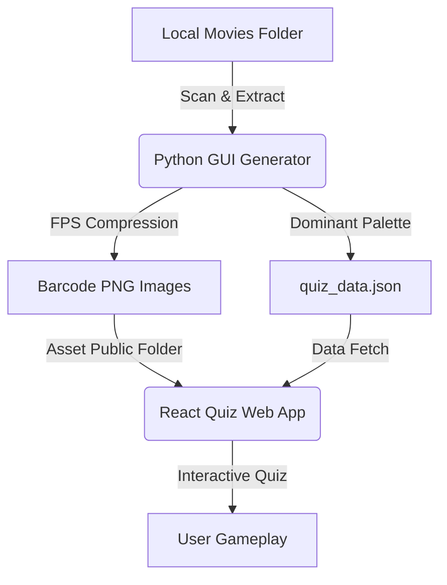

# 🎬 CineCode: Cinematic Color Timelines & Quiz

CineCode is a two-part interactive experience designed to explore the visual storytelling of cinema through color. By compressing entire feature films into chronological color barcodes (CineCodes), it reveals the narrative's emotional arc, pacing, and color grading in a single visual timeline.

This repository contains:
1. **The CineCode Generator & Manager:** A Python-based desktop application for batch-extracting color barcodes and dominant palettes from local video files.
2. **The CineCode Quiz:** A React + TypeScript web application where users test their movie knowledge by decoding these color barcodes.

---

## 🎨 UX/UI Design Philosophy

The CineCode ecosystem is built around **aesthetic immersion** and **gamified discovery**:

*   **Atmospheric Immersion:** Styled with a premium dark-theme theater aesthetic. Utilizes rich HSL color palettes, subtle glow effects, and glassmorphic panels (`backdrop-filter`) to mimic the feel of an auditorium.
*   **The Narrative of Color:** Color is a powerful storytelling tool. CineCode allows users to see a movie's transition from dark, somber tones (e.g., *The Matrix*) to vibrant, stylized grading (e.g., *La La Land*), highlighting how color guides audience emotion.
*   **Interactive Gamification:** The quiz features a high-fidelity visual matching loop. It uses responsive progress tracking, streak multiplier counters, visual heart indicators, and micro-animations for feedback transitions.
*   **Progressive Creator Tooling:** The generator app features a progressive real-time visualizer that renders the barcode frame-by-frame as FFmpeg processes the file, giving the creator immediate visual feedback on their output.

---

## 🕹️ Component Overview



### 1. CineCode Batch Generator & Manager (Desktop app)
A creation-side utility written in Python with Tkinter and styled to offer clean, card-based configurations:
*   **Directories Scanning:** Exclude folders dynamically (e.g., deleted scenes, extras).
*   **CineCode Settings:** Custom bar width, height, and **Smooth Bars** (averages colors for clean minimal visuals).
*   **Speed Optimization:** Skip non-reference frames or load only keyframes (I-frames) for super-fast runs.
*   **Multi-Select Database Manager:** Select, filter, and delete movie barcodes and database records in bulk.
*   **Title Cleanup Preview:** An interactive modal presenting a side-by-side comparison of original vs cleaned titles before writing to the database. Supports inline editing.

### 2. CineCode Quiz (Web app)
A TypeScript/Vite application optimized for smooth animations and responsiveness across mobile and desktop layout dimensions:
*   **Gameplay Modes:** Randomly swaps between guessing the film title from the barcode, or identifying the correct barcode from the film title.
*   **Dominant Color Reveals:** On correct guesses, the app unfolds a custom-curated dominant color swatch palette of the film.
*   **High Performance:** Incorporates skeletons/shimmers for barcode image loading, and falls back to CSS linear gradients of the color palette if assets are missing.

---

## ⚙️ Setup & Running Locally

### Prerequisites
*   **Python 3.8+** (for the Generator)
*   **Node.js 18+** (for the Quiz App)
*   **FFmpeg** (required by the generator to read video streams)

---

### Running the Generator GUI
1. Navigate to the project root directory.
2. Install the image processing dependency:
   ```bash
   pip install Pillow
   ```
3. Run the generator:
   ```bash
   python cinecode_generator_gui.py
   ```
4. Point the "Movies Directory" to your local movies folder and the "Output Directory" to `quiz-app/public/quiz`.

---

### Running the Quiz Web App
1. Navigate to the frontend directory:
   ```bash
   cd quiz-app
   ```
2. Install Node packages:
   ```bash
   npm install
   ```
3. Run the Vite development server:
   ```bash
   npm run dev
   ```
4. Open your browser to the URL displayed (usually `http://localhost:5173`).

---

## 🌐 Publishing to GitHub

Since Git is required to host code on GitHub, follow the steps below to initialize and upload this project.

### 1. Install Git (If not already installed)
If Git is missing from your command line, install it easily on Windows via terminal:
```powershell
winget install --id Git.Git -e --source winget
```
*(After installing, close and reopen your terminal window so the `git` command becomes active).*

### 2. Initialize and Push to GitHub
1. Create a new repository on your GitHub account (do not initialize with a README, `.gitignore`, or license).
2. Open terminal in the project root folder (`c:\Users\revan\Downloads\cinecode`) and run:
   ```bash
   # Initialize local repository
   git init

   # Add all files to staging
   git add .

   # Commit changes
   git commit -m "Initial commit: CineCode Generator and Quiz App"

   # Rename branch to main
   git branch -M main

   # Link your local repo to GitHub (Replace with your actual GitHub URL)
   git remote add origin https://github.com/YOUR_USERNAME/YOUR_REPO_NAME.git

   # Push code to GitHub
   git push -u origin main
   ```

Now, your code is fully hosted and accessible on GitHub!
