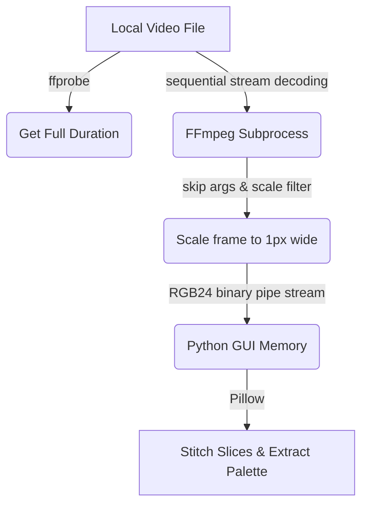
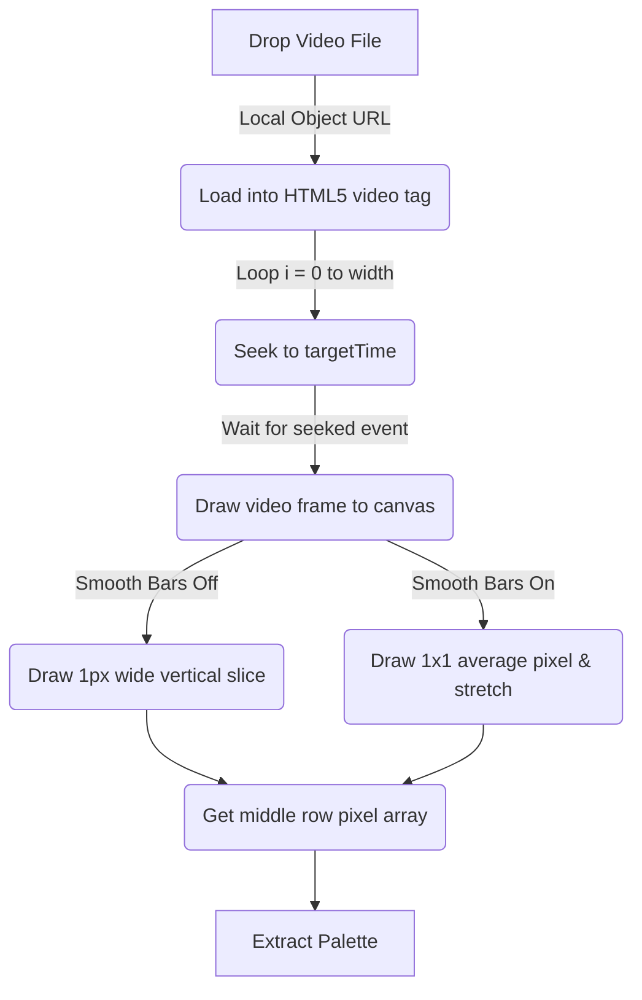

# CineCode Technical Architecture & Pipeline

This document provides a detailed, under-the-hood explanation of how both the **Python Desktop Generator** and the **React Web Generator** process movies, extract colors, and generate barcodes.

---

## 1. The Python Desktop Generator (`cinecode_generator_gui.py`)

The desktop application is a **stream-based sequential processor** written in Python. It delegates decoding work to `ffmpeg` and uses Python pipes and the Pillow library to assemble the final images.



### Step-by-Step Pipeline

#### A. Probing Metadata (`ffprobe`)
Before processing, the script needs to know the exact duration of the movie. It starts a background subprocess calling `ffprobe` to query the total length in seconds:
```python
probe_cmd = [
    ffprobe_path, "-v", "error", "-show_entries", "format=duration",
    "-of", "default=noprint_wrappers=1:nokey=1", movie_path
]
```
If a movie is 2 hours long, this returns `7200.0` seconds.

#### B. Frame Rate & Slicing Calculation
To create a barcode image of a specific width (e.g., `1000` pixels), we need to extract exactly `1000` frames evenly distributed across the movie. The script calculates the frame rate (FPS) needed to achieve this:
$$\text{Target FPS} = \frac{\text{Barcode Width}}{\text{Duration in Seconds}}$$
For a 2-hour movie:
$$\text{FPS} = \frac{1000}{7200} \approx 0.1388 \text{ frames per second (1 frame every 7.2 seconds)}$$

#### C. Spawning the FFmpeg Subprocess
Next, Python spawns an `ffmpeg` process. It uses command-line flags to filter and pipe raw pixel bytes directly into Python's memory:
```python
ffmpeg_cmd = [ffmpeg_path, "-y"] + skip_args + [
    "-i", movie_path,
    "-vf", f"fps={fps},{scale_filter}",
    "-f", "image2pipe", "-vcodec", "rawvideo", "-pix_fmt", "rgb24", "-"
]
```

*   **Decoding Modes (`skip_args`):**
    *   **High Quality (All Frames):** No skip arguments. Every single frame is decoded.
    *   **Fast (Skip B-Frames):** `["-skip_frame", "noref"]` (skips non-reference B-frames, saving CPU load).
    *   **Turbo (I-Frames Only):** `["-skip_frame", "nokey"]` (skips all P/B frames, only decoding standalone I-frames).
*   **The Scale Filter (`scale_filter`):**
    *   *Smooth Bars (Blur) Off:* `scale=1:{height}:flags=area`. FFmpeg downscales each frame into a thin $1 \times \text{height}$ strip (e.g., $1 \times 400$ pixels) using area-averaging.
    *   *Smooth Bars (Blur) On:* `scale=1:1:flags=area`. FFmpeg squashes the entire frame into a single $1 \times 1$ pixel containing the average color of the frame.
*   **Binary Piping (`-f image2pipe -vcodec rawvideo -pix_fmt rgb24 -`):**
    *   Instructs FFmpeg **not** to write images to disk. Instead, it converts decoded pixels to raw RGB24 binary format (3 bytes per pixel: Red, Green, Blue) and outputs them to standard output (`stdout`).

#### D. Reading the Pipe & Rendering
The Python GUI runs a loop that reads a constant stream of bytes from the FFmpeg subprocess:
*   *With Smooth Bars off:* It reads exactly `1 * height * 3` bytes per frame.
*   *With Smooth Bars on:* It reads exactly `1 * 1 * 3 = 3` bytes per frame.
*   As each frame's bytes arrive, Python adds them to a list and pushes them to a thread-safe GUI queue (`self.preview_queue`) to paint the progress bar and real-time visualization on the screen.

#### E. Image Reconstruction & Dominant Colors
Once the movie is finished, Pillow (`PIL.Image`) compiles the final image:
*   *Smooth Bars Off:* It stitches the $1 \times \text{height}$ vertical columns side-by-side.
*   *Smooth Bars On:* It stitches the $1 \times 1$ average pixels side-by-side to make a tiny $1000 \times 1$ image, then resizes it using `Image.Resampling.BILINEAR` up to the final size ($1000 \times 400$). This stretching causes the colors to blend into a smooth gradient.
*   **Dominant Color Extraction:** It grabs a horizontal slice of pixels from the vertical middle of the image, groups them into buckets of size 24 (to merge similar colors), excludes near-black (RGB < 20) and near-white (RGB > 240) pixels to avoid credits/fade-outs, and selects the top 5 colors that are at least a Euclidean distance of 60 apart in RGB space.

---

## 2. The React Web Generator (`cinecode-generator/src/App.tsx`)

The web generator is a **browser-native, seek-based processor**. Since web browsers do not have access to FFmpeg commands, it uses the browser's HTML5 `<video>` engine and hardware-accelerated 2D canvas API.



### Step-by-Step Pipeline

#### A. Local Video Loading
When you drop a video file, it generates a virtual object URL:
```javascript
const url = URL.createObjectURL(selectedFile);
videoRef.current.src = url;
```
This points directly to the file on your local hard drive. The browser loads the video metadata locally without uploading any bytes to a web server.

#### B. The Asynchronous Seek Loop
Instead of streaming a continuous feed like FFmpeg, the browser must seek to precise timestamps. The app runs a loop for the target width (e.g., `numFrames = 1000`):
$$\text{Target Time} = \text{Start Time} + (i \times \text{frameInterval})$$
For each frame, it sets the video's current time and awaits the browser's `seeked` event using a Promise. This pauses the loop until the browser decodes the frame at that timestamp:
```javascript
await new Promise((resolve) => {
  video.currentTime = targetTime;
  video.addEventListener('seeked', resolve, { once: true });
});
```

#### C. Canvas Slicing and Rendering
Once the browser decodes the frame at that timestamp, the app draws it onto a canvas:
*   **Smooth Bars (Blur) Off:** It grabs the video frame and draws a 1-pixel-wide slice directly onto the target output canvas:
    ```javascript
    outputCtx.drawImage(
      video,
      0, 0, video.videoWidth, video.videoHeight, // Source rect (Full frame)
      i, 0, 1, barcodeHeight                     // Destination rect (1px slice)
    );
    ```
*   **Smooth Bars (Blur) On:**
    1.  It draws the full video frame onto a hidden canvas of size $\text{barcodeWidth} \times 1$ at horizontal position `i` with a height of 1 pixel. This forces the browser to average the entire frame down into a single $1 \times 1$ pixel.
    2.  It immediately draws that $1 \times 1$ pixel onto the output canvas, stretching it to the full height:
        ```javascript
        outputCtx.drawImage(hiddenCanvas, i, 0, 1, 1, i, 0, 1, barcodeHeight);
        ```

#### D. Web Palette & Poster Export
*   **Palette Extraction:** Using `outputCtx.getImageData()`, it retrieves the pixel values of the horizontal center row and uses the same color clustering algorithm as the Python GUI to extract the 5 dominant colors.
*   **Poster Export:** If poster mode is checked, it creates a second canvas, paints a museum-matte ivory background (`#fbfbf9`), draws the barcode with a CSS-like drop-shadow, renders the 5-color palette strip at the bottom, and overlays the movie metadata using clean, editorial fonts (Georgia & Plus Jakarta Sans).

---

## 3. Comparison of Architectures

| Feature | Python Generator | Web Generator |
| :--- | :--- | :--- |
| **Engine** | FFmpeg (C-compiled CLI tool) | Browser HTML5 `<video>` engine |
| **Pipelining** | **Sequential stream decoding:** FFmpeg decodes continuously, matching the target FPS. Very fast. | **Discrete seeking:** The browser decodes, seeks, pauses, and decodes again 1000 times. Slower. |
| **Performance Modes** | High Quality, Fast (skip B-frames), and Turbo (I-frames only). | None. Speed is dependent on how fast the browser's hardware decoder seeks. |
| **Output Pipeline** | Writes binary raw RGB bytes to a stdout pipe stream. | Paints frames directly onto a GPU-accelerated HTML5 `<canvas>`. |
| **Scaling Algorithm** | FFmpeg `scale=1:{height}` or `scale=1:1` using Area downsampling. | Browser canvas 2D scaling + `imageSmoothingQuality = "high"`. |
| **Aesthetics Export** | Generates raw PNG and saves metadata to `quiz_data.json` directly. | Generates raw PNG or gallery-style typography posters. |
